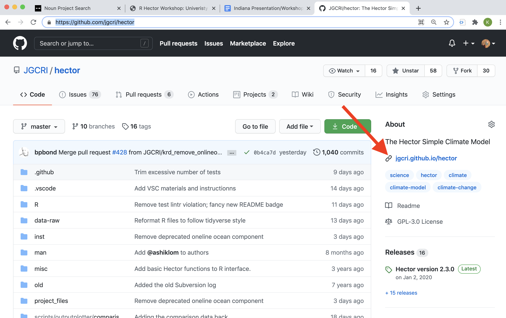
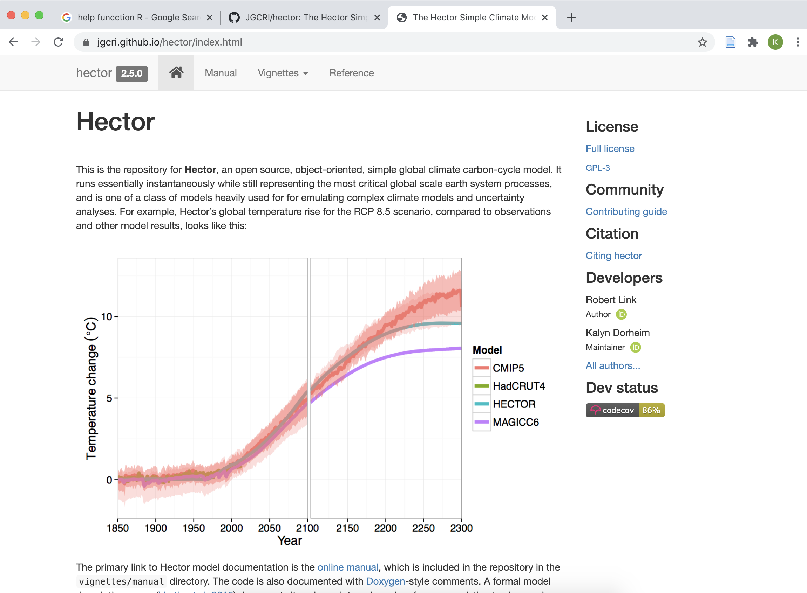

# Intro

Install Hector, run a simple RCP scenario, query results, and plot. 

## Installing Hector 

```{r, warning = FALSE, message = FALSE, echo = FALSE}
# If the remotes package has not been installed on your machine install it using the 
# install.packages function 
# install.packages("remotes")

# Load the remotes library 
library("remotes")

# Install the R Hector package from github
install_github("JGCRI/hector")
```


Load the packages we will need for the workshop exercises. If you have not already installed the packages use `install.packages("package_name")`.  

```{r, warning=FALSE, message = FALSE}
library("hector")  # Load the model 
library("ggplot2") # Load functions we will use to plot 
```


## Run a RCP 

Start by taking a look at the input files (ini) that are included in the Hector package.  

```{r}
list.files(system.file("input", package = "hector"))
```


There are ini files listed for the four [RCP pathways](https://en.wikipedia.org/wiki/Representative_Concentration_Pathwayhttps://en.wikipedia.org/wiki/Representative_Concentration_Pathwayv) (rcp 26, 45, 60, 85). For each RCP pathway, there are at least two ini files, the ini files that end in `_constrained.ini` run in concentration driven mode much like the Earth System Models, where the ${CO}_{2}$ concentrations are prescribed or constrained.  

Being able to run Hector with emissions or prescribed concentrations is a valuable and is an important feature of SCMs. 


Now select a single RCP scenario to run. 
```{r}
ini_file = system.file("input/hector_rcp45.ini", package = "hector")
```


Set up a Hector core using the ini file. 
```{r}
hcore = newcore(inifile = ini_file, name = "default rcp 45") 
```

Run Hector using the `run function`.
```{r}
run(core = hcore)
```

Query the results

```{r}
dates = 1850:2100
var = GLOBAL_TEMP()
data1 = fetchvars(core = hcore, dates = 1850:2100, vars = var)
```

And shut down the hector core. 

```{r}
shutdown(hcore)
```


Plot results, if you want to learn more about making plots with ggplo2 check out [Graphs Cookbook for R](http://www.cookbook-r.com/Graphs/).

```{r}
ggplot(data = data1) + 
  geom_line(aes(year, value, color = scenario)) + 
  labs(title = "Hector Global Mean Temp", 
       y = "deg C")
```


## Change a Parameter

Run Hector again but let's change the equilibrium climate sensitivity parameter. 

The first step will be to set up a new hector core, give it a new name. 

```{r}
ini_file = system.file("input/hector_rcp45.ini", package = "hector")
hcore = newcore(inifile = ini_file, name = "ECS x 2 rcp 45") 
run(core = hcore)
```

Now figure out what the default ECS value was.

```{r}
default_ECS = fetchvars(core = hcore, dates = NA, vars = ECS())
default_ECS
```

Increase the default ECS by a factor of 2 and get the information we will need to give the Hector core, the variable/parameter name, the unints, and value. 

```{r}
doubble_ECS = 2 * default_ECS$value
ECS_units = getunits(vars = ECS())
```

Pass the new ECS value to the Hector core. 

```{r}
setvar(core = hcore, dates = NA, var = ECS(), values = doubble_ECS, unit = ECS_units)
```

Run hector and get new results. 

```{r}
run(core = hcore)
```

Query the results.  

```{r}
data2 = fetchvars(core = hcore, dates = 1850:2100, vars = GLOBAL_TEMP())
data2
```

Now let's compare the results of the two different runs. 

```{r}
# Combine the data frames into a single data frame, then plot it. 
single_df <- rbind(data1, data2)

ggplot(data = single_df) + 
  geom_line(aes(year, value, color = scenario)) + 
  labs(title = "Hector Global Mean Temp", 
       y = "deg C")
```


# Documentation 


Some basic documentation for the `hector` R package can be accessed with R's `help` operator, which you can use on the package or an individual function. 

What happens when you run `help("hector")` or `help("newcore")` in R? 


If this still doesn't answer your questions or you are looking for examples checkout out Hector's github page,  [https://github.com/jgcri/hector](https://github.com/jgcri/hector), this has a link to the online documenation [https://jgcri.github.io/hector/](https://jgcri.github.io/hector/). 





At the [online documentation](https://jgcri.github.io/hector/index.html) you will find the [Hector manual](https://jgcri.github.io/hector/articles/manual/index.html) that has installation instructions, information about the model philosphy and so on. The Vigenettes tab is a list of example problems to follow along. The reference tab has a complete list of the package functions with links to detailed descriptions. 




If you have a question, bug, or problem please open a GitHub issue! That is the best way to get in contact with the Hector team. 

# Application 

ECS is the long-term temperature change after a doubling of atmospheric CO2 concentrations. For the complex ESM this is an emergent property where as it is a tunable paramters in most SCMs. The IPPC AR5 report says that the range of likely ECS is somewhere between 1.5 to 4.5 C. Let's use Hector to see what this range of ECS could mean for future temperature in the year 2100. Does the scenario make a difference? 

To do this we are going to need the ability to run a Hector core with different paramter values and query results mulitple times. The easiest way to  do this is by writting an [R function](https://nicercode.github.io/guides/functions/). 


```{r}
# Let's start by defining a function where we can set, run, and get results from a Hector. 
run_with_param <- function(core, value) {

  # Reset the Hector core value. 
  setvar(core = core, dates = NA, var = ECS(), value, unit = getunits(ECS()))
  run(core = core)
  
  # Query results 
  result <- fetchvars(core = core, dates = 1850:2100, vars = c(GLOBAL_TEMP(), OCEAN_SURFACE_TEMP(), NPP()))
  
  # Add a column with the parameter value. 
  result$ECS_value <- as.character(round(x = value, digits = 3))
  
  # Return the data frame.
  return(result)

}
```


Test out this function. 

```{r}
# Set up a Hetor core 
ini_file = system.file("input/hector_rcp85.ini", package = "hector")
hector_rcp85 = newcore(inifile = ini_file)

# Run Hector with some ECS value. 
data = run_with_param(core = hector_rcp85, value = 4)
data
```


Now set up a function that lets us run `run_with_param` several times. 
```{r}
run_with_param_range <- function(core, values){
  # the lapply function is an efficent way to apply a function to a list or vector but this will 
  # returnn a list of data frames.
  list <- lapply(values, run_with_param, core = core) 
  # format the list of data frames into a large data frame.
  out <- do.call("rbind", list) 
  return(out)
}
```


Now make a list of ECS values to sample. 

```{r}
ECS_values = seq(from = 1.5, to = 4.5, length.out = 10)
ECS_values
```


```{r}
# Run Hector RCP 85 
ini_file = system.file("input/hector_rcp85.ini", package = "hector")
hector_rcp85 = newcore(inifile = ini_file, name = "rcp85")
data_rcp85 = run_with_param_range(core = hector_rcp85, values = ECS_values)
shutdown(hector_rcp85)
```

Now let's run another scenario. 

```{r}
# Run Hector RCP 26
ini_file = system.file("input/hector_rcp26.ini", package = "hector")
hector_rcp26 = newcore(inifile = ini_file, name = "rcp26")
data_rcp26 = run_with_param_range(core = hector_rcp26, values = ECS_values)
shutdown(hector_rcp26)
```


Finally let's plot it! 


```{r, fig.width=10, fig.height=5}
data = rbind(data_rcp85, data_rcp26)

ggplot(data = data) + 
  geom_line(aes(year, value, color = ECS_value, linetype = scenario)) + 
  facet_wrap("variable", scales = "free")

```


